# Passo-a-passo para a criação do ambiente

<a href="https://youtu.be/QIK8Tt5m1v0">

## Baixe o .NET Core SDK

https://dotnet.microsoft.com/download

😱 Está com dificuldade para baixar a versão Windows de 32 bits (x86)? Veja [este tutorial](DotNetCore_x86_install.pdf) do professor [Diego Neri](https://github.com/diegoneri).

## Baixe o Visual Studio Code

https://code.visualstudio.com/download

## Baixe o git

https://git-scm.com/downloads

## Instalações

Você terá os seguintes arquivos:

## Instale .NET Core SDK

_Nenhuma configuração a fazer._

## Instale o Visual Studio Code

_A única configuração a fazer é selecionar as opções indicadas na 5ª imagem._

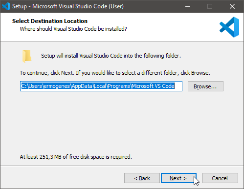
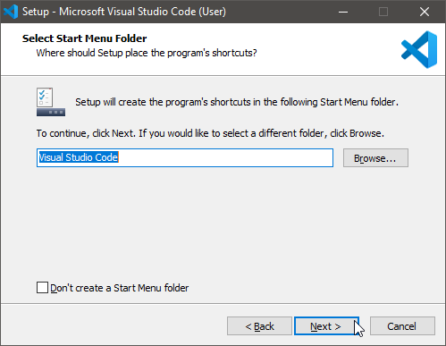

Marque as duas opções `Add "Open with Code"...`.

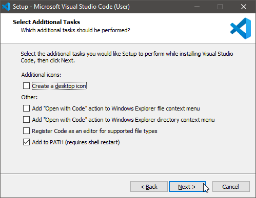

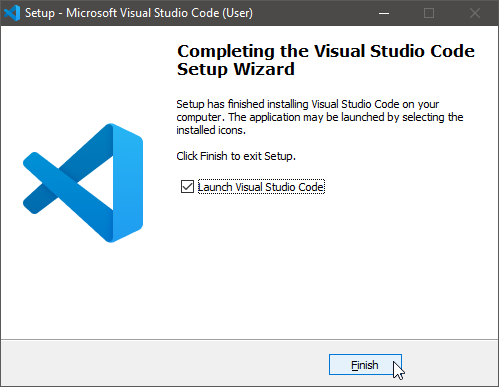

## Instale o git

_Nenhuma configuração a fazer._

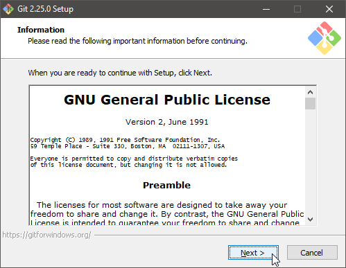

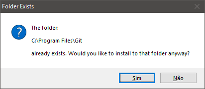
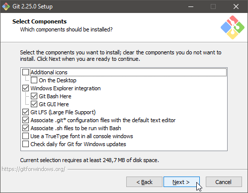
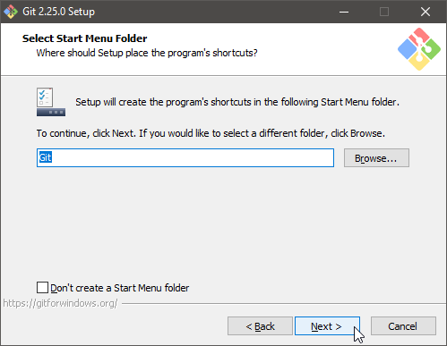
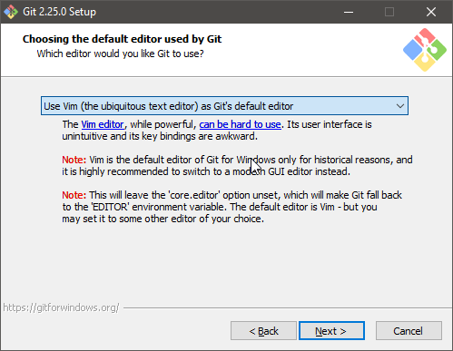

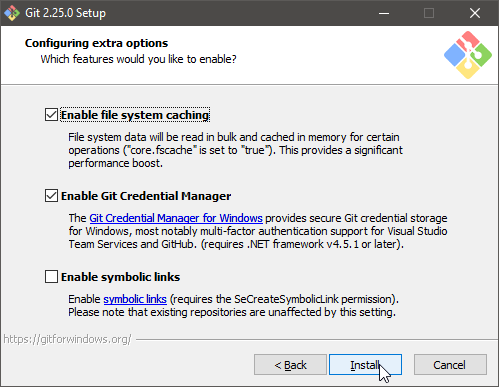
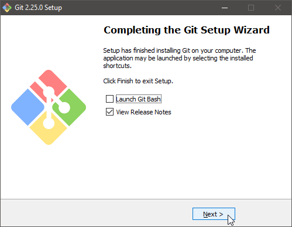

## Como desinstalar as versões antigas do .NET Core

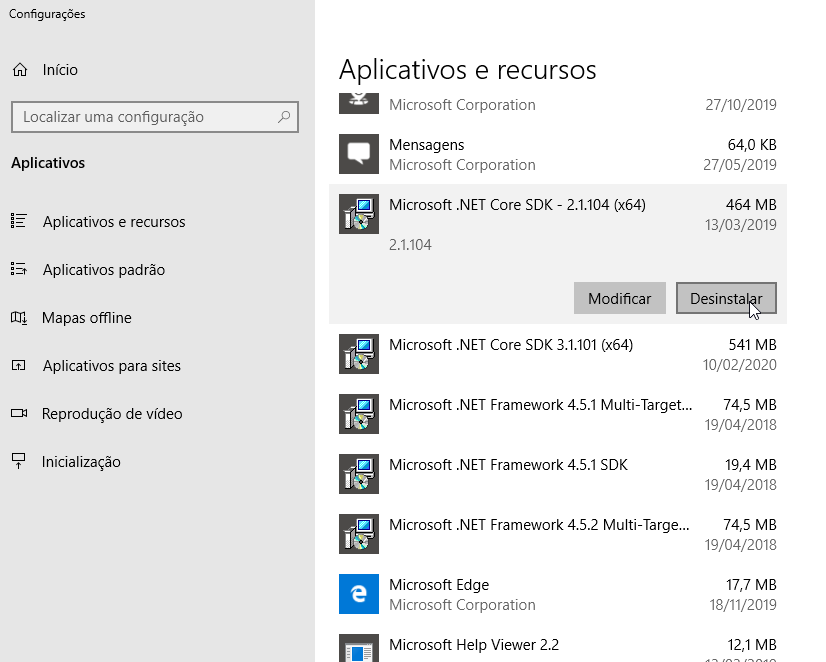

Deve permanecer somente a versão mais atual do .NET Core. As versões do .NET Framework podem continuar como estão. 
