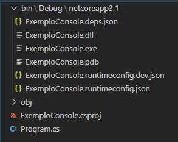

# Primeiros passos com C#

[📽 Veja esta vídeo-aula no Youtube](https://youtu.be/ersRRa5ymfo)

## Anatomia de um programa C#

Escreveremos nossos programas em arquivos texto contendo comandos da linguagem de programação, chamados _códigos-fonte_. Esses arquivos são organizados em _projetos_, sendo um projeto uma unidade de compilação, que gerará um _executável_, ou _assembly_ (no jargão .NET).

Criemos de um projeto chamado `ExemploConsole` com o template `console`:

```powershell
PS C:\Users\ermogenes\Desktop\code> dotnet new console -o ExemploConsole
The template "Console Application" was created successfully.

Processing post-creation actions...
Running 'dotnet restore' on ExemploConsole\ExemploConsole.csproj...
  Restauração concluída em 176,78 ms para C:\Users\ermogenes\Desktop\code\ExemploConsole\ExemploConsole.csproj.

Restore succeeded.

PS C:\Users\ermogenes\Desktop\code> cd .\ExemploConsole\
PS C:\Users\ermogenes\Desktop\code\ExemploConsole> code .
```

## Estrutura física

São criados 2 arquivos e uma pasta:


* `ExemploConsole.csproj` contém as configurações do seu projeto.
* `Program.cs` contém o código-fonte principal do seu programa.
* `obj` contém arquivos diversos, na maioria binários, necessários à compilação do projeto.

Vejamos o conteúdo de `ExemploConsole.csproj`:

 ```xml
 <Project Sdk="Microsoft.NET.Sdk">

  <PropertyGroup>
    <OutputType>Exe</OutputType>
    <TargetFramework>netcoreapp3.1</TargetFramework>
  </PropertyGroup>

</Project>
 ```

Este arquivo está escrito em XML, e contém algumas configurações.

* `OutputType` indica o tipo de assembly resultante.
* `TargetFramework` indica qual a versão do _runtime_ será necessária para rodar o aplicativo.

Agora, vejamos `Program.cs`:

```cs
using System;

namespace ExemploConsole
{
    class Program
    {
        static void Main(string[] args)
        {
            Console.WriteLine("Hello World!");
        }
    }
}
```

Este sim, código escrito em C#. Voltaremos nele em breve.

Vamos compilar a aplicação.

```powershell
PS C:\Users\ermogenes\Desktop\code\ExemploConsole> dotnet build
Microsoft(R) Build Engine versão 16.4.0+e901037fe para .NET Core
Copyright (C) Microsoft Corporation. Todos os direitos reservados.

  Restauração concluída em 31,92 ms para C:\Users\ermogenes\Desktop\code\ExemploConsole\ExemploConsole.csproj.
  ExemploConsole -> C:\Users\ermogenes\Desktop\code\ExemploConsole\bin\Debug\netcoreapp3.1\ExemploConsole.dll

Compilação com êxito.
    0 Aviso(s)
    0 Erro(s)

Tempo Decorrido 00:00:02.76
PS C:\Users\ermogenes\Desktop\code\ExemploConsole> 
```

Foi criada a pasta `bin`.


Dentro dela, em `bin\Debug\netcoreapp3.1` encontramos os assemblies.



Entre eles, `ExemploConsole.exe`, o nosso programa executável.

Iremos criar diversos outros arquivos `.cs` em nossos projetos, e podemos livremente organizá-los em pastas.

## Estrutura lógica

C# é uma linguagem orientada a objetos, o que significa que (quase) tudo em nossos programas são **classes**.

Voltemos ao código:

```cs
using System;

namespace ExemploConsole
{
    class Program
    {
        static void Main(string[] args)
        {
            Console.WriteLine("Hello World!");
        }
    }
}
```

* `class Program { ... }`: Todos nossos códigos estarão vinculados a uma classe. Nesse exemplo, a classe se chama `Program`. Tudo que está entre as chaves `{}` faz parte da classe `Program`.
* `namespace ExemploConsole`: Podemos organizar nossos arquivos logicamente, independentemente das organizações em pastas. Namespaces permitem essa organização. Nesse exemplo, o 'nome completo' da classe `Program` é `ExemploConsole.Program`.
* `using System`: Indica que vamos utilizar elementos contidos no namespace `System`, existentes em todas as instalações do .NET.
* `static void Main(string[] args)`: Define uma funcionalidade (chamada método) dentro da classe `Program` chamada `Main`. Em aplicações do tipo console, `Main` é a primeira ação a ser efetuada assim que o programa é executado. Devemos escrever nesse bloco a funcionalidade desejada nos nossos programas.
* `Console.WriteLine("Hello World!")`: Executamos o método `WriteLine` contido na classe `Console` do namespace `System`. Esse comando exibe uma sequência de texto em uma nova linha na saída do console.
