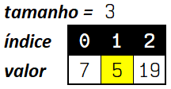
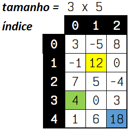
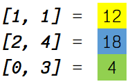
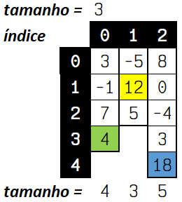

# Arranjos (_arrays_)

[📽 Veja esta vídeo-aula no Youtube](https://youtu.be/0pYKPcDL0IU)

Arranjos são estruturas de dados que permitem armazenar diversos valores de algum tipo sob um mesmo identificador, como se fossem múltiplas variáveis. Possuem diversas denominações como arranjo, _array_, variável indexada, vetor (quando unidimensional) e matriz (quando multidimensional).

Arranjos possuem tamanho fixo e acesso direto a cada elemento através de índices.

## Arranjos unidimensionais (vetores)

Um vetor possui somente uma dimensão.

Exemplo 1:

```cs
int[] numeros = new int[3];
numeros[0] = 7;
numeros[1] = 5;
numeros[2] = 19;
```



* `numeros` é o identificador do arranjo;
* `int[]` indica o tipo: um arranjo de inteiros;
* `new int[3]` inicializa o arranjo com `3` espaços para inteiros;
* os elementos são numerados por um índice sequencial iniciado em `0` e terminado em `tamanho -1`;


* `numeros[1]` indica o segundo elemento da lista, no caso `5`;
* `numeros[7]` indica o oitavo elemento da lista (que não existe), gerando um erro.

Exemplo 2:

```cs
int[] maisNumeros = new int[10];
maisNumeros[0] = 7;
maisNumeros[1] = 5;
maisNumeros[2] = 19;
maisNumeros[3] = 4;
maisNumeros[4] = -2;
maisNumeros[5] = 0;
maisNumeros[6] = 5;
maisNumeros[7] = 0;
maisNumeros[8] = 1;
maisNumeros[9] = 3;
```


* o arranjo `maisNumeros` possui `10` elementos;


* `maisNumeros[7]` indica o oitavo elemento da lista, o inteiro `0`.

Podemos também definir o tamanho implicitamente:

```cs
string[] nomes = new string[] { "João", "Maria", "José", "Ana" };
string[] sobrenomes = { "Silva", "Souza" };
```

* `nomes` é um arranjo de strings com `4` elementos;
* `sobrenomes` é um arranjo de strings com `2` elementos;
* `"${nomes[2]} {sobrenomes[0]}"` retorna a string `"José Silva"`.

Podemos obter o tamanho de um arranjo utilizando `Length`:

```cs
Console.WriteLine($"Nosso vetor possui {nomes.Length} nomes.");
```

## Arranjos multidimensionais (matrizes)

Matrizes possuem múltiplas dimensões e podem ser regulares ou irregulares (_jagged_).

Exemplo 3 (matriz regular):





Exemplo 4 (matriz irregular):




Veja exemplos de código no programa da vídeo-aula.

## Informações sobre um arranjo

Podemos coletar diversas informações sobre um arranjo. Algumas delas:

* `Length` retorna o tamanho do arranjo (número de elementos);
* `Rank` retorna o número de dimensões;
* `GetLowerBound` retorna o menor índice de uma dimensão (limite inferior);
* `GetUpperBound` retorna o maior índice de uma dimensão (limite superior).

Com essas informações (e o uso de contadores) podemos facilmente percorrer todos os itens de um arranjo utilizando laços de repetição.

---

Programa da [vídeo-aula](https://youtu.be/0pYKPcDL0IU):

```cs
using System;

namespace AulaArranjos
{
    class Program
    {
        static void Main(string[] args)
        {
            // Vetores: declaração, atribuição e acesso
            Console.WriteLine("-- Vetores: declaração, atribuição e acesso");
            int[] n = new int[3];
            n[0] = 17;
            n[1] = -5;
            n[2] = 0;
            
            int soma = n[0] + n[1] + n[2];

            Console.WriteLine($"soma = {soma}");

            string[] linguagens;
            linguagens = new string[4];

            linguagens[0] = "Python";
            linguagens[1] = "Java";
            linguagens[2] = "C#";
            linguagens[3] = "JavaScript";

            string linguagemUtilizada = linguagens[2];

            Console.WriteLine($"Utilizado: {linguagemUtilizada}");

            // Inicialização
            Console.WriteLine("-- Inicialização");
            string[] nomes = new string[] { "João", "Maria", "José", "Ana" };
            string[] nomes2 = { "João", "Maria", "José", "Ana" };

            // Tamanho de um arranjo
            Console.WriteLine("-- Tamanho de um arranjo");
            Console.WriteLine($"Nosso vetor possui {nomes.Length} nomes.");

            // Percorrendo matrizes com laços usando while
            Console.WriteLine("-- Percorrendo matrizes com laços usando while");
            int contador = 0;
            while (contador < linguagens.Length)
            {
                Console.WriteLine($"A {contador+1}ª linguagem é {linguagens[contador]}");
                contador++;
            }

            // Percorrendo matrizes com laços usando for
            Console.WriteLine("-- Percorrendo matrizes com laços usando for");
            for (int i = 0; i < linguagens.Length; i++)
            {
                Console.WriteLine($"A {i+1}ª linguagem é {linguagens[i]}");
            }
            
            // Percorrendo matrizes com laços usando for, reverso
            Console.WriteLine("-- Percorrendo matrizes com laços usando for, reverso");
            for (int i = linguagens.Length - 1; i >= 0; i--)
            {
                Console.WriteLine($"A {i+1}ª linguagem é {linguagens[i]}");
            }

            // Percorrendo matrizes com laços usando foreach
            Console.WriteLine("-- Percorrendo matrizes com laços usando foreach");
            foreach (string linguagem in linguagens)
            {
                Console.WriteLine(linguagem);
            }

            // Matrizes: arranjos multidimensionais
            Console.WriteLine("-- Matrizes: arranjos multidimensionais");
            int[,] a = new int[2, 4];
            a[0, 3] = 15;

            int[,] m = { { 1, 2, 3, 4 }, { 5, 6, 7, 8 } };

            int itemDesejado = m[1,2];
            Console.WriteLine($"m[1,2] = {itemDesejado}");

            // Informações sobre uma matriz
            Console.WriteLine("-- Informações sobre uma matriz");
            Console.WriteLine($"Tamanho: {m.Length}");
            Console.WriteLine($"Número de dimensões: {m.Rank}");
            Console.WriteLine($"Limite inferior da dimensão 0: {m.GetLowerBound(0)}"); // 0
            Console.WriteLine($"Limite superior da dimensão 0: {m.GetUpperBound(0)}"); // 1
            Console.WriteLine($"Limite inferior da dimensão 1: {m.GetLowerBound(1)}"); // 0
            Console.WriteLine($"Limite superior da dimensão 1: {m.GetUpperBound(1)}"); // 3

            // Percorrendo uma matriz com for
            Console.WriteLine("-- Percorrendo uma matriz com for");
            for (int i0 = m.GetLowerBound(0); i0 <= m.GetUpperBound(0); i0++)
            {
                for (int i1 = m.GetLowerBound(1); i1 <= m.GetUpperBound(1); i1++)
                {
                    Console.WriteLine($"m[{i0}, {i1}] = {m[i0, i1]}");
                }
            }

            // Percorrendo uma matriz com foreach
            Console.WriteLine("-- Percorrendo uma matriz com foreach");
            foreach(int item in m)
            {
                Console.Write($"{item} ");
            }

            // Matrizes irregulares
            Console.WriteLine("\n-- Matrizes irregulares");
            string[] filmes = {
                "Matrix",
                "Senhor dos Anéis",
                "Titanic"
            };

            string[][] generosDosFilmes = {
                new string[2] { "Ação", "Ficção Científica"},
                new string[1] { "Fantasia" },
                new string[] { "Romance", "Baseado em fatos reais"}
            };

            string filme = filmes[0];
            string genero = generosDosFilmes[0][1];

            Console.WriteLine($"O filme {filme} é do gênero {genero}.");

            // Percorrendo uma matriz irregular com for
            Console.WriteLine("-- Percorrendo uma matriz irregular com for");
            for (int i0 = 0; i0 < generosDosFilmes.Length; i0++)
            {
                for (int i1 = 0; i1 < generosDosFilmes[i0].Length; i1++)
                {
                    Console.WriteLine($"{filmes[i0]} -> {generosDosFilmes[i0][i1]}");
                }
            }

            // Percorrendo uma matriz irregular com foreach
            Console.WriteLine("-- Percorrendo uma matriz irregular com foreach");
            foreach (string[] generosDoFilme in generosDosFilmes)
            {
                foreach (string generoDoFilme in generosDoFilme)
                {
                    Console.WriteLine(generoDoFilme);
                }
            }

            // Alterando um vetor "in-place"
            Console.WriteLine("-- Alterando um vetor \"in-place\"");
            Array.Sort(nomes);
            Array.Reverse(nomes);

            foreach (string nome in nomes)
            {
                Console.WriteLine(nome);
            }

            // Aplicação: entrada de itens em uma lista
            Console.WriteLine("-- Aplicação: entrada de itens em uma lista");
            string[] estadosCivis = { "Solteiro", "Casado", "Viúvo" };

            Console.WriteLine("1. Solteiro, 2. Casado, 3. Viúvo");
            Console.Write("Digite seu estado civil: ");

            int valorDigitado = Convert.ToInt32(Console.ReadLine());

            string estadoCivilSelecionado = estadosCivis[valorDigitado - 1];

            Console.WriteLine($"Selecionado: {estadoCivilSelecionado}");

            // Aplicação: guardar muitos valores
            Console.WriteLine("-- Aplicação: guardar muitos valores");

            Console.Write("Digite a quantidade de números: ");
            int numeroDeItens = Convert.ToInt32(Console.ReadLine());

            int[] rolagens = new int[numeroDeItens];

            Random gerador = new Random();

            for (int i = 0; i < numeroDeItens; i++)
            {
                rolagens[i] = gerador.Next(1, 7);
            }

            Array.Sort(rolagens);

            foreach (int rolagem in rolagens)
            {
                Console.Write($"{rolagem} ");
            }

            // Aplicação: sorteando valores em uma lista
            Console.WriteLine("\n-- Aplicação: sorteando valores em uma lista");
            string[] sobrenomes = {
                "Santos",
                "Gonçalves",
                "Carvalho",
                "Moura"
            };

            Console.Write("Quantos nomes? ");
            int quantidade = Convert.ToInt32(Console.ReadLine());

            for (int i = 1; i <= quantidade; i++)
            {
                int sorteioNome = gerador.Next(nomes.Length);
                int sorteioSobrenome = gerador.Next(sobrenomes.Length);

                string nomeSorteado = $"{nomes[sorteioNome]} {sobrenomes[sorteioSobrenome]}";
                Console.WriteLine($"{i}º nome sorteado: {nomeSorteado}");
            }

        }
    }
}
```

**Saída**:

```
C:\Users\ermogenes\Documents\DevCs\AulaArranjos>dotnet run
-- Vetores: declaração, atribuição e acesso
soma = 12
Utilizado: C#
-- Inicialização
-- Tamanho de um arranjo
Nosso vetor possui 4 nomes.
-- Percorrendo matrizes com laços usando while
A 1ª linguagem é Python
A 2ª linguagem é Java
A 3ª linguagem é C#
A 4ª linguagem é JavaScript
-- Percorrendo matrizes com laços usando for  
A 1ª linguagem é Python
A 2ª linguagem é Java
A 3ª linguagem é C#
A 4ª linguagem é JavaScript
-- Percorrendo matrizes com laços usando for, reverso
A 4ª linguagem é JavaScript
A 3ª linguagem é C#
A 2ª linguagem é Java
A 1ª linguagem é Python
-- Percorrendo matrizes com laços usando foreach
Python
Java
C#
JavaScript
-- Matrizes: arranjos multidimensionais
m[1,2] = 7
-- Informações sobre uma matriz
Tamanho: 8
Número de dimensões: 2
Limite inferior da dimensão 0: 0
Limite superior da dimensão 0: 1
Limite inferior da dimensão 1: 0
Limite superior da dimensão 1: 3
-- Percorrendo uma matriz com for
m[0, 0] = 1
m[0, 1] = 2
m[0, 2] = 3
m[0, 3] = 4
m[1, 0] = 5
m[1, 1] = 6
m[1, 2] = 7
m[1, 3] = 8
-- Percorrendo uma matriz com foreach
1 2 3 4 5 6 7 8 
-- Matrizes irregulares
O filme Matrix é do gênero Ficção Científica.
-- Percorrendo uma matriz irregular com for
Matrix -> Ação
Matrix -> Ficção Científica
Senhor dos Anéis -> Fantasia
Titanic -> Romance
Titanic -> Baseado em fatos reais
-- Percorrendo uma matriz irregular com foreach
Ação
Ficção Científica
Fantasia
Romance
Baseado em fatos reais
-- Alterando um vetor "in-place"
Maria
José
João
Ana
-- Aplicação: entrada de itens em uma lista
1. Solteiro, 2. Casado, 3. Viúvo
Digite seu estado civil: 2
Selecionado: Casado
-- Aplicação: guardar muitos valores
Digite a quantidade de números: 15
1 1 1 2 2 2 2 2 2 2 5 6 6 6 6
-- Aplicação: sorteando valores em uma lista
Quantos nomes? 10
1º nome sorteado: João Moura
2º nome sorteado: Maria Moura
3º nome sorteado: Maria Moura
4º nome sorteado: Maria Santos
5º nome sorteado: Maria Carvalho
6º nome sorteado: Ana Moura
7º nome sorteado: Maria Gonçalves
8º nome sorteado: José Carvalho
9º nome sorteado: José Carvalho
10º nome sorteado: Maria Santos
```
