# Depuração (_debug_)

<!-- [📽 Veja esta vídeo-aula no Youtube](https://youtu.be/xxxxxx) -->

Permite que se acompanhe a execução do programa passo-a-passo, visualizando os valores de suas variáveis e avaliando expressões.

É utilizado principalmente para investigação e correção de _bugs_.

## Configuração do VsCode

As opções do depurador ficam na aba `Run`:

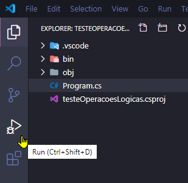

O método `Launch` deve estar selecionado.

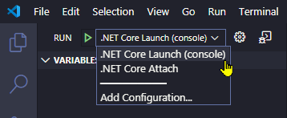

O console interno do depurador não é compatível com entrada via teclado. Devemos configurar o depurador para utilizar o terminal integrado do VsCode. Para isso, abra o arquivo de configuração `launch.json` clicando no ícone indicado:

Altere a opção `console` de `internalConsole` para `integratedTerminal`.

Antes:

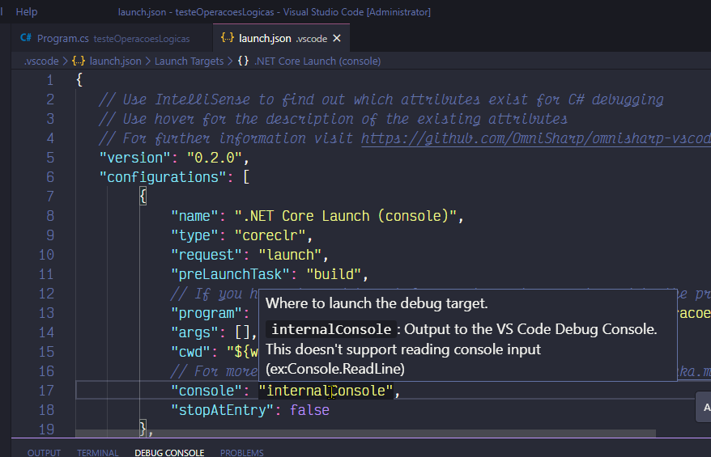

Depois:

Suas configurações ficam salvas em `.vscode/launch.json`.

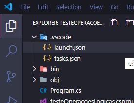

## Pontos de parada (_breakpoints_)

Você deve incluir pelo menos um ponto de parada para o depurador. Sem eles, seu programa executará até o final sem que você possa interagir.

Podemos adicionar _breakpoints_ clicando ao lado dos números de linha.

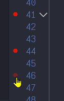

No exemplo, o depurador parará nas linhas 41, 44 e 46.

A janela `Breakpoints` permite que você veja os pontos de parada configurados:

Na maioria dos casos simples você pode colocar um _breakpoint_ na primeira linha do método `Main`, permitindo que você acompanhe toda a execução do programa.

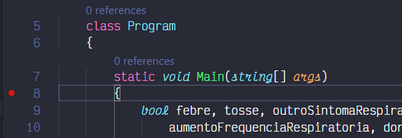

## Iniciando a depuração

Para executar o programa em modo de depuração clique no ícone de execução:

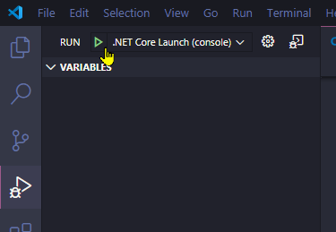

A barra de status ficará vermelha:

Surgirá um menu de depuração no canto superior direito:

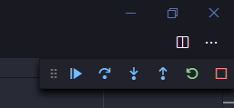

A janela `Variables` mostrará todas as variáveis acessíveis no ponto atual de execução, com seus valores:

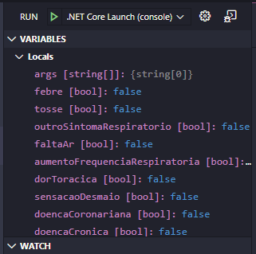

O depurador executará até encontrar o primeiro _breakpoint_.

Agora você pode controlar a sequência dos próximos comandos.

## Executando trechos de código

Para ir até o próximo _breakpoint_ utilize a opção `Continue` ou pressione <kbd>F5</kbd>:

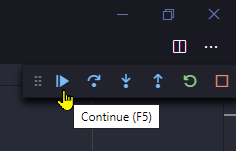

Para executar uma linha por vez, utilize a opção `Step Over` ou pressione <kbd>F10</kbd>:

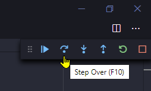

As demais opções são:
* `Step Into` (<kbd>F11</kbd>): Como `Step Over`, mas entra na subrotina a ser executada.
* `Step Out` (<kbd>Shift+F11</kbd>): Como `Step Over`, mas sai da subrotina atual.
* `Restart` (<kbd>Ctrl+Shift+F5</kbd>): Reinicia a depuração.
* `Stop` (<kbd>Shift+F5</kbd>): Termina a depuração.

## Inspecionando o programa

Você pode analisar os valores atuais das variáveis de diversas maneiras.

**`Variables`**

A lista de variáveis disponíveis está em `Variables`. Você pode inclusive alterá-los diretamente utilizando a opção `Set Value`.

**Cursor sobre a variável, no código**

Ao passar o cursor sobre uma variável, você verá o seu valor atual.

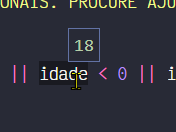

**`Watches`**

A janela `Watches` permite que você crie expressões a serem avaliadas automaticamente pelo depurador.

Você pode colocar uma variável ou uma expressão contida no seu código selecionando-a e clicando na opção `Add to watch`:

Você também pode observar o valor de uma expressão que não existe no seu código, criando-a diretamente na janela `Watches`:

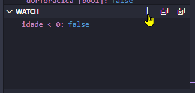

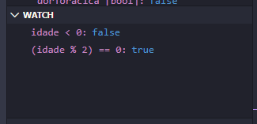

Use e abuse da depuração. Ela é a melhor amiga do programador.