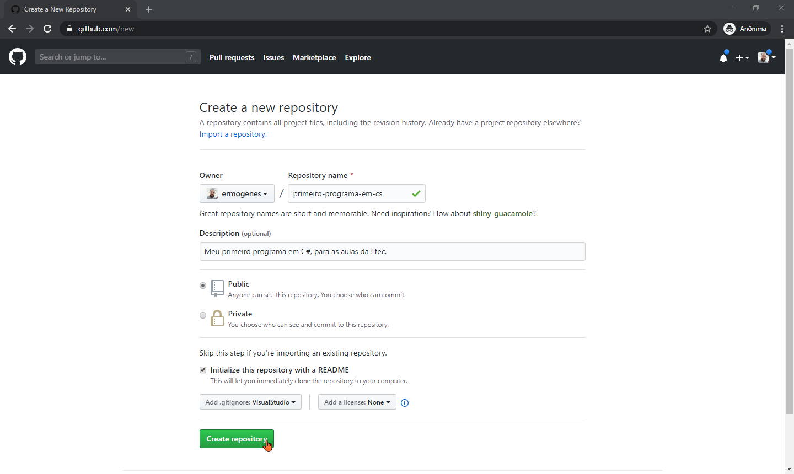
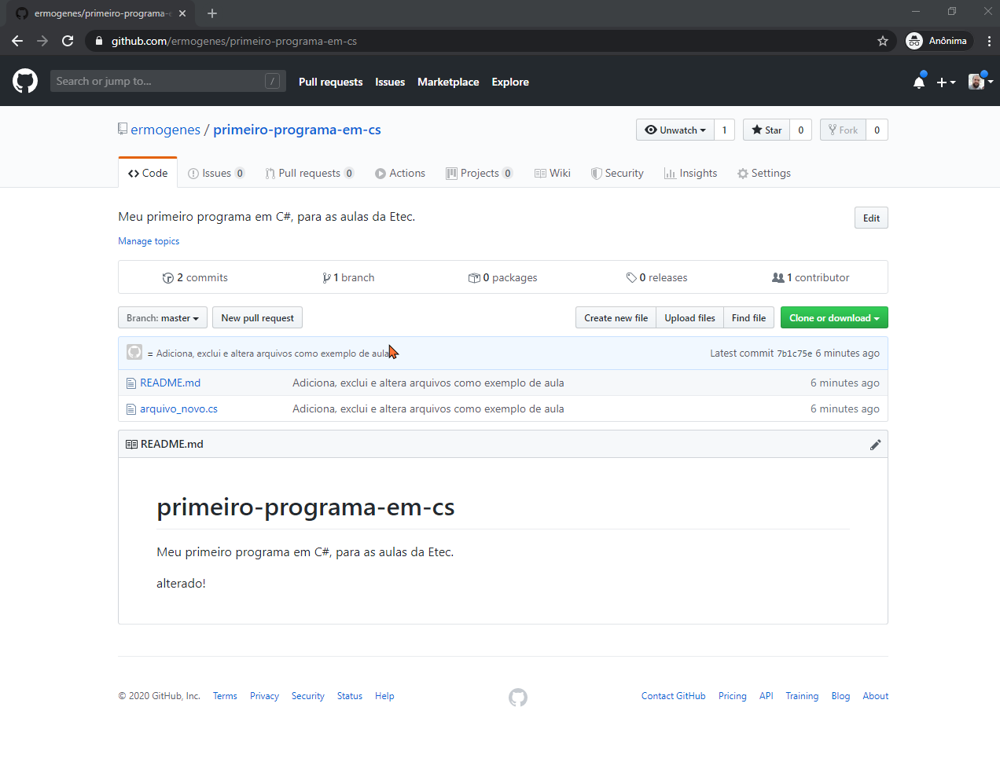

# GitHub

📽 https://youtu.be/8dbglVmDylU

Vamos utilizar o repositório gratuito GitHub para salvar nossos projetos.

## Criando sua conta

Acesse https://github.com/ e crie sua conta.


Guarde bem o e-mail, o nome de usuário e a senha.

Efetue o login sempre que necessário.

## Criando um novo repositório

Estando logado, acesse a opção `New Repository`.


Preencha os campos a seguir:
- `Repository name`: nome do seu projeto, deve ser único para cada usuário
- `Description`: descrição do projeto, opcional
- `Public/Private`: visibilidade do seu repositório
- `Initialize this repository with a README`: marque essa opção para poder alterar o texto da página inicial
- `Add .gitignore`: Selecione `VisualStudio` para projetos com C#



Seu repositório de projeto está criado.


## Preparando o ambiente local

Verifique se o `git` está instalado:

```powershell
PS C:\Users\ermogenes> git --version
git version 2.22.0.windows.1
```

Verifique se o seu usuário e e-mail estão configurados:

```powershell
PS C:\Users\ermogenes\desktop\aulas\primeiro-programa-em-cs> git config user.name
Ermogenes Palacio
PS C:\Users\ermogenes\desktop\aulas\primeiro-programa-em-cs> git config user.email
meu-email@meu-servidor.com
PS C:\Users\ermogenes\desktop\aulas\primeiro-programa-em-cs> 
```

* Caso não esteja configurado, use os seguintes comandos para fazê-lo:

```powershell
PS C:\Users\ermogenes\desktop\aulas\primeiro-programa-em-cs> git config --global user.name = "Ermogenes Palacio" 
PS C:\Users\ermogenes\desktop\aulas\primeiro-programa-em-cs> git config --global user.email = "meu-email@meu-servidor.com"
```

_Pode ser necessário fazer essa configuração todas as vezes que utilizar na Etec._

## Abrindo o projeto localmente

Na página inicial do seu projeto, obtenha o endereço do repositório:


Acesse a pasta em que seu repositório será baixado (nela será criada uma nova pasta com o nome do repositório).

```powershell
PS C:\Users\ermogenes> cd desktop
PS C:\Users\ermogenes\desktop> cd aulas
PS C:\Users\ermogenes\desktop\aulas> dir
PS C:\Users\ermogenes\desktop\aulas> 
```

Faça o download do repositório, utilizando o endereço obtido anteriormente:

```powershell
PS C:\Users\ermogenes\desktop\aulas> git clone https://github.com/ermogenes/primeiro-programa-em-cs.git
Cloning into 'primeiro-programa-em-cs'...
remote: Enumerating objects: 4, done.
remote: Counting objects: 100% (4/4), done.
remote: Compressing objects: 100% (4/4), done.
remote: Total 4 (delta 0), reused 0 (delta 0), pack-reused 0
Unpacking objects: 100% (4/4), done.
PS C:\Users\ermogenes\desktop\aulas> 
```

Verifique se os arquivos foram baixados.

```powershell
PS C:\Users\ermogenes\desktop\aulas> dir


    Diretório: C:\Users\ermogenes\desktop\aulas


Mode                LastWriteTime         Length Name
----                -------------         ------ ----
d-----       03/02/2020     16:14                primeiro-programa-em-cs


PS C:\Users\ermogenes\desktop\aulas> cd primeiro-programa-em-cs   
PS C:\Users\ermogenes\desktop\aulas\primeiro-programa-em-cs> dir


    Diretório: C:\Users\ermogenes\desktop\aulas\primeiro-programa-em-cs


Mode                LastWriteTime         Length Name
----                -------------         ------ ----
-a----       03/02/2020     16:14           6352 .gitignore
-a----       03/02/2020     16:14             80 README.md


PS C:\Users\ermogenes\desktop\aulas\primeiro-programa-em-cs> 
```

Estando na pasta raíz do repositório local, abra o projeto no Visual Studio Code:

```powershell
PS C:\Users\ermogenes\desktop\aulas\primeiro-programa-em-cs> code .
```

Seu projeto estará aberto no VSCode.


## Salvando alterações

Altere normalmente seu projeto, adicionando, removendo e alterando arquivos conforme necessário.

Ao finalizar uma etapa, você pode adicionar o estado atual no controle de versão local do `git`.

Tenha o costume de sempre verificar o estado atual do seu projeto: 

```powershell
PS C:\Users\ermogenes\desktop\aulas\primeiro-programa-em-cs> git status
On branch master
Your branch is up to date with 'origin/master'.

Changes not staged for commit:
  (use "git add/rm <file>..." to update what will be committed)
  (use "git checkout -- <file>..." to discard changes in working directory)

        deleted:    .gitignore
        modified:   README.md

Untracked files:
  (use "git add <file>..." to include in what will be committed)

        arquivo_novo.cs

no changes added to commit (use "git add" and/or "git commit -a")
PS C:\Users\ermogenes\desktop\aulas\primeiro-programa-em-cs> 
```

A saber:
* `deleted`: arquivos excluídos
* `modified`: arquivos alterados
* `untracked files`: arquivos novos

Todos as alterações necessitam ser adicionadas à lista de modificações a serem aceitas. O comando a seguir adiciona tudo de uma vez:

```powershell
PS C:\Users\ermogenes\desktop\code\aulas-programacao-csharp> git add .
PS C:\Users\ermogenes\desktop\code\aulas-programacao-csharp> 
```

Veja o novo status:

```powershell
PS C:\Users\ermogenes\desktop\aulas\primeiro-programa-em-cs> git status
On branch master
Your branch is up to date with 'origin/master'.

Changes to be committed:
  (use "git reset HEAD <file>..." to unstage)

        deleted:    .gitignore
        modified:   README.md
        new file:   arquivo_novo.cs

PS C:\Users\ermogenes\desktop\aulas\primeiro-programa-em-cs> 
```

Todas as alterações estão na lista `Changes to be committed`.

Agora, podemos gravar efetivamente as alterações no controle de versão local.

```powershell
PS C:\Users\ermogenes\desktop\aulas\primeiro-programa-em-cs> git commit -m "Adiciona, exclui e altera arquivos como exemplo de aula"
[master 7b1c75e] Adiciona, exclui e altera arquivos como exemplo de aula
 3 files changed, 2 insertions(+), 350 deletions(-)
 delete mode 100644 .gitignore
 create mode 100644 arquivo_novo.cs
PS C:\Users\ermogenes\desktop\aulas\primeiro-programa-em-cs> 
```

Veja o status agora:

```powershell
PS C:\Users\ermogenes\desktop\aulas\primeiro-programa-em-cs> git status
On branch master
Your branch is ahead of 'origin/master' by 1 commit.
  (use "git push" to publish your local commits)

nothing to commit, working tree clean
PS C:\Users\ermogenes\desktop\aulas\primeiro-programa-em-cs> 
```

Notem que o texto `origin/master` aparece em diversos locais.
- `origin` é o nome do seu repositório remoto, endereço de localização da origem do clone (nesse exemplo, https://github.com/ermogenes/primeiro-programa-em-cs.git)
- `master` é o nome do branch, existente tanto na versão local quanto na remota.
- `origin/master` indica o branch `master` no repositório remoto `origin`, já que os dois combinados com a barra `/`, estamos nos dizem respeito à uma branch remota (`origin/master` = remoto/branch).

Agora devemos atualizar o branch no repositório remoto. 

Para isso, precisamos saber o nome do branch local e do remoto.

```powershell
PS C:\Users\ermogenes\desktop\aulas\primeiro-programa-em-cs> git branch
* master
PS C:\Users\ermogenes\desktop\aulas\primeiro-programa-em-cs> git remote
origin
PS C:\Users\ermogenes\desktop\aulas\primeiro-programa-em-cs> 
```

Sabemos agora que o local é `master` e o remoto é `origin`.

Vamos enviar as alterações locais para o repositório remoto:

```powershell
PS C:\Users\ermogenes\desktop\aulas\primeiro-programa-em-cs> git push origin master
Enumerating objects: 6, done.
Counting objects: 100% (6/6), done.
Delta compression using up to 4 threads
Compressing objects: 100% (3/3), done.
Writing objects: 100% (4/4), 334 bytes | 167.00 KiB/s, done.
Total 4 (delta 1), reused 0 (delta 0)
remote: Resolving deltas: 100% (1/1), completed with 1 local object.
To https://github.com/ermogenes/primeiro-programa-em-cs.git
   f76c9c3..7b1c75e  master -> master
PS C:\Users\ermogenes\desktop\aulas\primeiro-programa-em-cs> 
```
_Notem que não há `/` entre o `origin` e o `master` nesse comando._

Enviado com sucesso. Verificamos novamente o status:

```powershell
PS C:\Users\ermogenes\desktop\aulas\primeiro-programa-em-cs> git status
On branch master
Your branch is up to date with 'origin/master'.

nothing to commit, working tree clean
PS C:\Users\ermogenes\desktop\aulas\primeiro-programa-em-cs> 
```

Podemos verificar também no GitHub.


