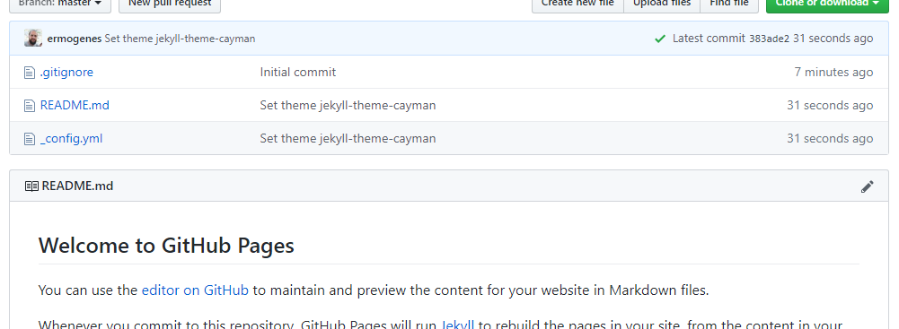
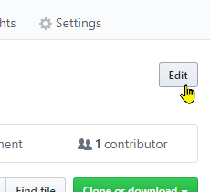

# Publicação

Para publicar a versão atual do projeto use:

```
dotnet publish -c Release
```

Será criada uma pasta em `bin\Release\netcoreapp3.1\publish` com o conteúdo a ser distribuído.

Para executar, acessa essa pasta e digite:

```
dotnet NomeDoProjeto.dll
```

No Windows você pode digitar somente `NomeDoProjeto`, ou dar duplo clique arquivo `.exe`.

Essa versão será portátil, ou seja, poderá ser executada em qualquer sistema operacional que suporte .NET, como Windows, Linux, MacOS, etc. desde que instalado o .NET Core Runtime.

# Distribuição

Uma maneira de distribuir seu projeto é criando um site para que se possa fazer o download. Podemos fazer isso utilizando o GitHub Pages.

* Crie um `.zip` com o conteúdo da pasta `publish`.
* Salve esse arquivo em uma pasta `dist`, na raiz do seu projeto.
* Escreva um arquivo README bacana, incluindo link de download (apontando para o `.zip` em `dist`).
* Publique como um site usando o GitHub Pages.

## GitHub Pages

Entre em _Settings_:


Ative o GitHub Pages para a _branch_ `Master`:


Será exibido um link para seu site. Guarde esse link.


Escolha um tema:


Salve.


Será feito um _commit_ que alterará sua página inicial. Pode ignorar. Volte à página inicial.



Edite a descrição para incluir o link:




Ficará assim:


**Altere o arquivo `README.md` livremente. Ele será convertido para HTML e será sua _home-page_**

Você pode divulgar somente o link do seu site, sem que a pessoa precise conhecer o GitHub.