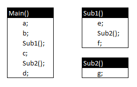
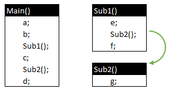
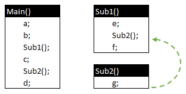
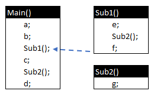
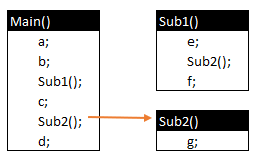
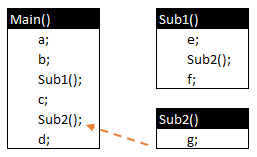

# Sub-rotinas

[📽 Veja esta vídeo-aula no Youtube](https://youtu.be/fIkw8BTA800)

Sub-rotinas são trechos de código que recebem um nome identificador e que podem ser executados diversas vezes em diferentes pontos do seu programa, permitindo assim uma melhor organização e a não repetição de comandos.

Todo programa tem ao menos uma sub-rotina. Em aplicações console, ela se chama `Main`. Você pode definir quantas sub-rotinas quiser.

Nesse exemplo, `Main`, `Sub1` e `Sub2` são sub-rotinas, e `a` ... `g` são comandos quaisquer.



Ao executar o comando `Sub1()`, o programa passa o controle para `Sub1`, que é executada completamente antes de retornar para o chamador. Isso pode acontecer sucessivamente, de forma que os retornos sejam executados um a um, do último para o primeiro. Esse comportamento de pilha (_o último a ser concluído é o primeiro a retornar_) é chamado `Call Stack` (pilha de execução).

Exemplo:












O grafo completo da sequência de execução é:


Dessa forma, os comandos executados serão, na sequência:

- `a`, em `Main()`;
- `b`, em `Main()`;
- `e`, em `Main()` → `Sub1()`;
- `g`, em `Main()` → `Sub1()` → `Sub2()`;
- `f`, em `Main()` → `Sub1()`;
- `c`, em `Main()`;
- `g`, em `Main()` → `Sub2()`;
- `d`, em `Main()`.

Em C# (e na maioria das linguagens orientadas a objetos) uma sub-rotina é chamada de **método**.

## Tipos de sub-rotinas

Um método pode ou não retornar um resultado. Um exemplo de método que não retorna resultado é `Console.WriteLine`. Ele exibe algo na saída padrão, e pronto, não a nada a fazer. Uma situação totalmente diferente acontece com `Console.ReadLine`, onde o seu processamento requer o retorno de um resultado: a string digitada pelo usuário.

* Sub-rotinas _sem_ retorno são chamadas de **procedimentos**.
* Sub-rotinas _com_ retorno são chamadas de **funções**.
* Ambas são criadas em C# utilizando **métodos**.

## Assinatura

Um método é definido a partir de uma assinatura. Analisemos a assinatura dos dois métodos citados.

A assinatura do método `Clear` na classe `System.Console` é:

```cs
public static void Clear ();
```

- `public` indica que o método pode ser acessado por qualquer arquivo que faça referência a `System` (através do comando `using`);
- `static` indica é um método de classe e não de objeto (conceitos que serão explicados na aula sobre classes);
- `void` indica que não haverá retorno, ou seja, se trata de um procedimento;
- `Clear` é o nome identificador do método;
- `()` indica a lista de parâmetros esperados pela sub-rotina, nesse caso, nenhum.

Uma das assinatura do método `WriteLine` na classe `System.Console` é:

```cs
public static void WriteLine (string value);
```

- `string value` define um parâmetro de entrada que deve ser informado ao executar o método. Nesse caso, deve-se indicar um argumento do tipo string que será acessível dentro do método através do identificador `value`.

## Métodos estáticos e não-estáticos

Métodos estáticos (que incluem o modificador `static`) não necessitam de uma instância da classe para serem executados, diferentemente de métodos não-estáticos.

Exemplo de métodos estático:

```cs
Console.WriteLine("Olá, usuário.");
```

O método `WriteLine` é executado diretamente via a classe `Console`.

Exemplo de método não-estático:

```cs
Random gerador = new Random();
gerador.Next(7);
```

Para executar o método `Next` necessitamos de um objeto da classe `Random`.

Métodos não estáticos serão tratados no tópico sobre classes.

## Criando um procedimento

O exemplo abaixo mostra um procedimento `ExibeHoraAtual` criado na classe padrão `Program` sendo executado duas vezes.

```cs
using System;

namespace ExemploProcedimento
{
    class Program
    {
        static void Main(string[] args)
        {
            // Usando procedimentos para não repetir código
            Program.ExibeHoraAtual();
            Console.WriteLine("Pressione uma tecla...");
            Console.ReadKey();
            Program.ExibeHoraAtual();
        }

        static void ExibirHoraAtual()
        {
            Console.ForegroundColor = ConsoleColor.Red;
            Console.WriteLine(DateTime.Now.ToLongTimeString());
            Console.ResetColor();
        }
    }
}
```

Com isso evitamos a duplicidade de código e facilitamos a manutenção do programa.

## Funções

Estudemos agora o exemplo abaixo:

```cs
using System;

namespace ExemploFuncao
{
    class Program
    {
        static void Main(string[] args)
        {
            double a = 3, b = 4, c = 5;

            double area = AreaTriangulo(a, b, c);
            Console.WriteLine($"O triângulo possui área de {area:N2}.");
        }

        static double AreaTriangulo(double lado1, double lado2, double lado3)
        {
            double s = (lado1 + lado2 + lado3) / 2;
            return Math.Sqrt(s * (s - lado1) * (s - lado2) * (s - lado3));
        }
    }
}
```

São criadas 3 variáveis `double`, `a`, `b` e `c`, com os valores `3`, `4` e `5`, respectivamente. Os valores dessas variáveis são passados como argumentos para a função `AreaTriangulo` que exige três parâmetros do tipo `double` chamados `lado1`, `lado2` e `lado3` para retornar um resultado também do tipo `double`. Esse retorno será gravado na variável `area` e exibido ao usuário.

Quando chamada, a função terá os valores dos argumentos acessíveis através dos parâmetros `lado1`, `lado2` e `lado3`. Ela trabalha com essas variáveis normalmente, executa o cálculo do resultado e o retorna ao chamador através do comendo `return`.

`AreaTriangulo` permite que seja calculada a área de um triângulo a partir de quaisquer valores de lado informados. Essa é uma forma de se reaproveitar código e tornar seu programa mais legível e manutenível.

## Escopo de variáveis

Uma variável declarada dentro de um bloco só é visível em seu contexto. Use a estrutura de parâmetros/argumentos para transferir valores entre métodos.

No exemplo acima:

- `a`, `b`, `c` e `area` só estão disponíveis em `Main`;
- `lado1`, `lado2`, `lado3` e `s` só estão disponíveis em `AreaTriangulo`.

## Recursividade

Uma função pode chamar a si mesma quando necessário. Essa funcionalidade chama-se recursividade. Nesse caso, certifique-se que a função chegará ao fim, ou você entrará em uma situação similar a um laço infinito.

Exemplo de função recursiva:

```cs
using System;

namespace FatorialRecursivo
{
    class Program
    {
        static void Main(string[] args)
        {
            Console.WriteLine($"Fatorial de 1 = {Fatorial(1)}");
            Console.WriteLine($"Fatorial de 5 = {Fatorial(5)}");
            Console.WriteLine($"Fatorial de 7 = {Fatorial(7)}");
            Console.WriteLine($"Fatorial de 13 = {Fatorial(13)}");
        }

        static int Fatorial (int n)
        {
			if (n == 1)
            {
				return 1;
			}
			return n * Fatorial(n - 1);
		}
    }
}
```

💡 Dica: Use o depurador do VsCode para entender como essa função consegue chegar no resultado desejado.

De maneira geral, tudo que é feito com recursividade pode ser feito com técnicas iterativas utilizando laços.