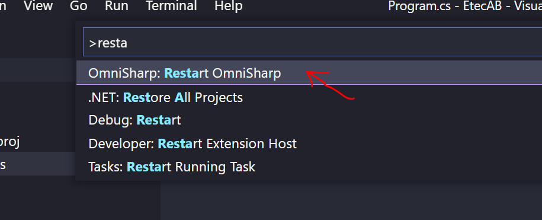

# Novos templates .NET 6

Com o início do suporte a C# 10, o .NET 6 adaptou seus _templates_ iniciais de vários tipos de projetos para acompanhar a evolução da linguagem.

Com isso, aplicações `console` podem ser substancialmente simplificadas em termos de código inicial requerido. Essa alteração chama-se _top-level statements_, e traz ao C# uma maior simplicidade para aprendizagem e código mais limpo, bem como uma semelhança com outras linguagens populares como JavaScript, PHP e Python, por exemplo (se distanciando de uma de suas inspirações iniciais, a linguagem Java).

Boa parte desse curso foi feita em .NET em versões anteriores à 6 (3.1 e 5). Vamos entender aqui as mudanças e vamos explorar maneiras de se utilizar o código dos materiais já criados.

## SDK e _Runtimes_

SDKs são os softwares que instalamos para que possamos programar em .NET. Contém o compilador e tudo que é necessário para que, dado o código-fonte, possa ser criado o programa executável.

_Runtimes_, por sua vez, são necessários somente para que os programas sejam executados. Todo programa compilado em .NEt necessita de um _runtime_ em versão compatível para rodar. De maneira geral, instalações Windows incorporam _runtimes_ de .NET nas versões mais recentes, mas sempre é possível instalá-los separadamente.

Quando se instala o SDK, ele sempre acompanha um _runtime_ compatível.

Para verificar o que está instalado em seu sistema, use:

SDKs instaladas:
```
dotnet --list-sdks
```

_Runtimes_ instaladas:
```
dotnet --list-runtimes
```

Informação completa sobre seu sistema:
```
dotnet --info
```

Exemplo de resposta de `dotnet --info` (`...` _representa conteúdo omitido_):

```
SDK do .NET (refletindo qualquer global.json):
 Version:   6.0.101
...

Ambiente de runtime:
 OS Name:     Windows
 OS Version:  10.0.19043
...

Host (useful for support):
  Version: 6.0.1
...

.NET SDKs installed:
  3.1.410 [C:\Program Files\dotnet\sdk]
  5.0.302 [C:\Program Files\dotnet\sdk]
  6.0.101 [C:\Program Files\dotnet\sdk]

.NET runtimes installed:
...
  Microsoft.NETCore.App 3.1.16 [C:\Program Files\dotnet\shared\Microsoft.NETCore.App]
  Microsoft.NETCore.App 5.0.8 [C:\Program Files\dotnet\shared\Microsoft.NETCore.App]
  Microsoft.NETCore.App 6.0.1 [C:\Program Files\dotnet\shared\Microsoft.NETCore.App]
...

To install additional .NET runtimes or SDKs:
  https://aka.ms/dotnet-download
```

Perceba que esse ambiente está usando o SDK `6.0.101` e o _runtime_ `6.0.1` (veja em _Host_). São as versões mais recente no momento que escrevo esse texto.

[Aqui](https://aka.ms/dotnet-download) você pode ver e baixar versões mais recentes ou mais antigas.

## Diferenças nos _templates_ de aplicação `console` em .NET 5 e 6

Ao usar `dotnet new console` até a versão 5 era criado um programa semelhante a esse:

Exemplo de solução do exercício `EtecAB`:

`EtecAB.csproj`:
```xml
<Project Sdk="Microsoft.NET.Sdk">

  <PropertyGroup>
    <OutputType>Exe</OutputType>
    <TargetFramework>net5.0</TargetFramework>
  </PropertyGroup>

</Project>
```

`Program.cs`:
```cs
using System;

namespace EtecAB
{
    class Program
    {
        static void Main(string[] args)
        {
            Console.WriteLine("Etec Adolpho Berezin");
        }
    }
}
```

O mesmo programa, no _template_ do .NET 6 ficaria assim:

`EtecAB.csproj`:
```xml
<Project Sdk="Microsoft.NET.Sdk">

  <PropertyGroup>
    <OutputType>Exe</OutputType>
    <TargetFramework>net6.0</TargetFramework>
    <ImplicitUsings>enable</ImplicitUsings>
    <Nullable>enable</Nullable>
  </PropertyGroup>

</Project>
```

`Program.cs`:
```cs
Console.WriteLine("Etec Adolpho Berezin");
```

### Mudanças em `.csproj`

A principal mudança é a diretiva `TargetFramework`. Ela indica qual _runtime_ será utilizado para rodar o programa. A versão indicada deve estar disponível no ambiente de execução.

- `netcoreapp3.1` exige algum .NET Runtime versão 3 (chamado .NET Core 3).
- `net5.0` exige algum .NET Runtime versão 5.
- `net6.0` exige algum .NET Runtime versão 6.

Caso você tenha um programa console escrito para .NET 5 e queira rodar em .NET 6, você pode somente mudar `<TargetFramework>net5.0</TargetFramework>` para `<TargetFramework>net6.0</TargetFramework>` que geralmente ele vai rodar (_não funcionará se forem necessários outros pacotes, posi eles tem que ser atualizados também_).

As outras duas linhas novas no _template_ do .NET 6 habilitam novos recursos da linguagem que permitem a simplificação do arquivo `Program.cs`.

### Mudanças em `Program.cs`

Programas escritos com o _template_ do .NET 6 não vão rodar em versões anteriores. A combinação de novos recursos da linguagem C# em suas versões 9 e 10 tornam o código mais sucinto, porém incompatível com os _runtimes_ e SDKs anteriores.

Diversas partes do código inicial podem agora ser removidas.

- `using` agora é implícito para `System` e algumas outras bibliotecas frequentemente utilizadas;
- a indicação de uma função `Main` (em um `namespace` e `class`) não é mais necessária devido ao recurso chamado _top-level statements_ criado para que o compilador possa descobrir automaticamente o seu ponto de início. 

Assim, só precisamos escrever o código que iria no bloco `Main` diretamente no arquivo `Program.cs`, sem nenhum texto adicional.

O código gerado com esses itens explícitos continua funcionando.

Para migrar um código no modelo .NET 5 para um em modelo .NET 6, faça o seguinte:

Em `.csproj`:
- mude o `TargetFramework` para `net6.0`;
- adicione as diretivas` <ImplicitUsings>enable</ImplicitUsings>` e `<Nullable>enable</Nullable>`.

Em `Program.cs`:
- Exclua todas as linhas exceto aquelas no bloco `Main`.

Esse procedimento precisará de adaptações em programas que usem diretivas `using` diferentes daquelas implícitas, que usem pacotes NuGet, e que modifiquem membros da classe que contém `Main` (dados ou comportamentos). Se isso ocorrer, faça as mudanças pontualmente. Nesse curso, tenha atenção com o exemplos das aulas de [Pacotes](../content/pacotes.md), [Publicação e distribuição](../content/publish_dist.md), [Sub-rotinas](../content/subroutines.md) e na maioria dos Tópicos Adicionais.

## Diferenças no VsCode

Até o presente momento, o plugin do C# para o VsCode ainda não trabalha bem com _top-level statements_ por padrão. Faça o seguinte procedimento para garantir que tudo estará OK em seu ambiente.

Primeiro, garante que o VsCode está atualizado.


Instale o plugin oficial do C# (_C# for Visual Studio Code (powered by OmniSharp)._) procurando por `ms-dotnettools.csharp`.


Vá em _Extension settings_ e procure por `.net 6`. Ative a opção _Omnisharp: Use Modern Net_.


Caso continue mostrando erro no código, reinicie o Omnisharp, pressionando `Ctrl+Shift+P` e buscando a opção `Omnisharp: Restart Omnisharp`.



Em último caso, reinicie o VsCode.

## Quando deve sair outra versão?

Você pode acompanhar por [aqui](https://dotnet.microsoft.com/en-us/platform/support/policy/dotnet-core) a política de versões da plataforma .NET.