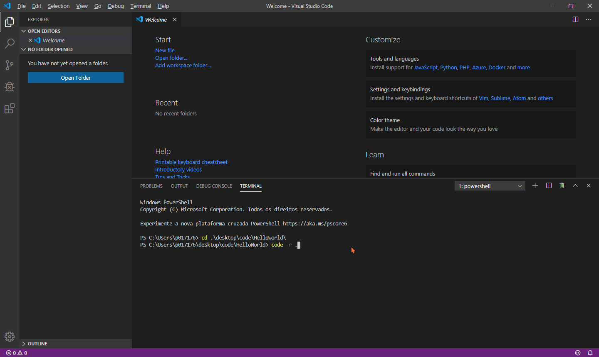
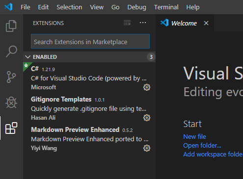
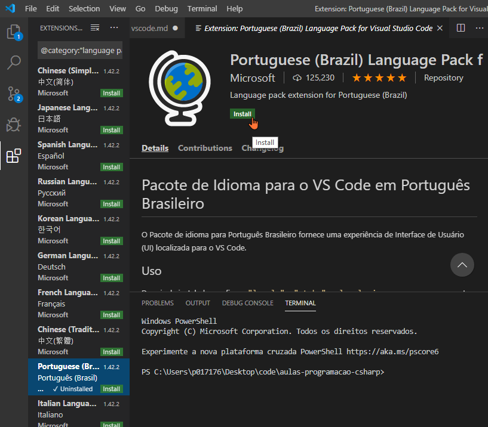

# Usando o Visual Studio Code

<a href="https://youtu.be/x2eTHiEpPEg"></a>

## Tela inicial


## Como abrir uma pasta

**Método 1**: Pelo explorador


**Método 2**: Pelo menu 'Abrir'


**Método 3**: Pelo menu de contexto do Windows


**Método 4**: Pelo terminal do Windows


**Método 5**: Pelo terminal do VsCode

```powershell
code .
```

Para forçar a abrir na mesma janela

```powershell
code -r .
```

Para forçar a abrir em uma nova janela

```powershell
code -n .
```

## Como utilizar o terminal integrado




## Como navegar entre arquivos na pasta aberta

Através da aba `Explorer`


## Como instalar extensões

Através da aba `Extensions`



- C# - `ms-vscode.csharp` - extensão oficial da Microsoft para C#
- Gitignore Templates - `hasanali.gitignore-templates` - gerador de `gitignore` (para C# use o template `VisualStudio`)
- Markdown Preview Enhanced - `shd101wyy.markdown-preview-enhanced` - visualizador integrado de Markdown

## Como mudar a língua do VsCode para português (pt-br)

Dentro do VsCode, pressione `F1`, digite `Configure Display Language` e confirme.


Caso não apareça `pt-br` na lista, escolha `Install additional languages...`:


Selecione a língua desejada e clique em `Install`.



Surgirá uma notificação avisando que o VsCode será reiniciado. Confirme.


